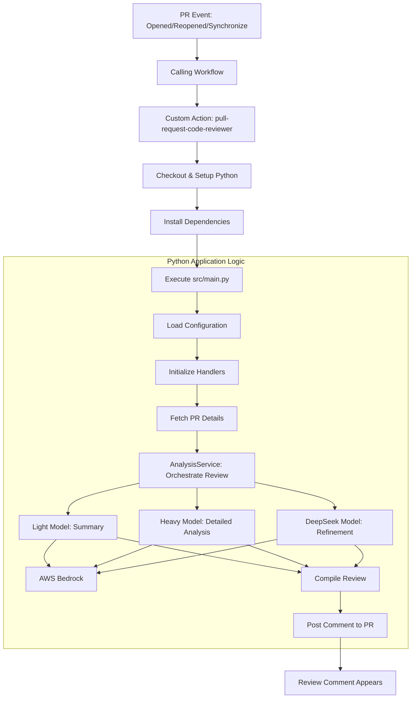

# AI-Powered Pull Request Code Reviewer

This project provides a GitHub Action that leverages AI, specifically AWS Bedrock language models, to automatically review pull requests. It posts a comment on the PR detailing a summary of changes and an in-depth analysis of potential issues, adherence to best practices, style concerns, and suggestions for improvement.

## Features

    *   **Automated PR Comments:** Delivers code review feedback directly to pull requests.
    *   **Change Summarization:** Provides a concise summary of the changes introduced in the PR.
    *   **In-depth Code Analysis:** Utilizes powerful language models for a comprehensive review of code modifications.
    *   **Configurable AI Models:** Allows selection of different AWS Bedrock models for various analysis tasks (summary, detailed review, refinement).
    *   **Secure Credential Handling:** AWS credentials and GitHub tokens are managed via environment variables in the calling workflow.
    *   **Technology Stack:** Built with Python, using `PyGithub` for GitHub API interactions and `Boto3` for AWS Bedrock.

## Workflow Diagram

The following diagram illustrates the automated pull request review process:



## Technical Overview

The solution is architected as a GitHub Action that orchestrates a Python application to perform AI-driven code reviews.

### Action Execution (`action.yml`)

    1.  **Trigger**: The Action is designed to be used as a step in workflows, typically triggered by `pull_request` events (e.g., `opened`, `reopened`, `synchronize`) in the consuming repository.
    2.  **Inputs**: It accepts `aws_region`, `heavy_model_id`, `light_model_id`, `deepseek_model_id`, `github_token` (defaults to `github.token`), and an optional `calling_repo_token`.
    3.  **Secrets**: Sensitive information like `AWS_ACCESS_KEY_ID` and `AWS_SECRET_ACCESS_KEY` are expected to be set as environment variables by the calling workflow. This aligns with security best practices by keeping secret management within the caller's context.
    4.  **Environment Setup**:
        *   Checks out the reviewer's source code (this repository).
        *   Sets up the specified Python version (e.g., 3.12).
        *   Installs Python dependencies from `requirements.txt`.
    5.  **Python Application Execution**: Runs the main script `src/main.py`, passing workflow inputs and secrets as environment variables.

### Python Application (`src/`)

The core logic resides in the `src/` directory:

    *   **`main.py` (Entry Point)**:
        *   Orchestrates the entire review process.
        *   Initializes configuration and service handlers.
        *   Retrieves PR information, triggers analysis, and posts results.

    *   **`config.py` (Configuration Management)**:
        *   Loads configuration from environment variables. This includes:
            *   GitHub related: `GITHUB_EVENT_PATH`, `GITHUB_REPOSITORY`, `GITHUB_TOKEN`, `CALLING_REPO_TOKEN`.
            *   AWS related: `AWS_ACCESS_KEY_ID`, `AWS_SECRET_ACCESS_KEY`, `AWS_DEFAULT_REGION` (derived from `inputs.aws_region`).
            *   Model IDs: `HEAVY_MODEL_ID`, `LIGHT_MODEL_ID`, `DEEPSEEK_MODEL_ID`.
        *   Provides a centralized way to access configuration values.

    *   **`github_handler.py` (GitHub Interaction)**:
        *   Uses the `PyGithub` library to interact with the GitHub API.
        *   Responsible for:
            *   Authenticating using `GITHUB_TOKEN` (or `CALLING_REPO_TOKEN` if provided).
            *   Parsing the GitHub event payload (`GITHUB_EVENT_PATH`) to get PR context (PR number, repository).
            *   Fetching PR details: changed files, diffs.
            *   Posting the generated review comment back to the pull request.

    *   **`bedrock_handler.py` (AWS Bedrock Interaction)**:
        *   Uses the `boto3` library to communicate with AWS Bedrock.
        *   Handles the construction of requests and invocation of different language models based on their IDs.
        *   Manages API responses and extracts the generated text.
        *   Implements error handling and retry mechanisms for Bedrock API calls (as per AWS SDK defaults and potentially custom logic).

    *   **`analysis_service.py` (Code Analysis Orchestration)**:
        *   Contains the core logic for generating the code review.
        *   Prepares prompts tailored for each analysis step.
        *   Coordinates calls to `BedrockHandler` for:
            1.  **Summarization**: Uses the `light_model_id` (e.g., `anthropic.claude-instant-v1`) to generate a brief summary of the PR changes from the diff.
            2.  **Detailed Analysis**: Iterates over changed code sections. For each significant change, it uses the `heavy_model_id` (e.g., `anthropic.claude-v2`) to perform an in-depth review, looking for bugs, style issues, security vulnerabilities, and improvement areas.
            3.  **Refinement (Optional but configured)**: Takes the output from the `heavy_model_id` and uses the `deepseek_model_id` (e.g., `meta.llama2-13b-chat-v1`) to potentially refine, elaborate, or filter the analysis for higher quality and relevance.
        *   Formats the outputs from the models into a structured review comment.

## How to Use

This is a GitHub Action. To integrate it into your repository:

    1.  Create a workflow file (e.g., `.github/workflows/ai_code_reviewer.yml`) in your repository.
    2.  Define a job that uses this Action as a step. You must provide necessary AWS credentials as environment variables and the required inputs to the Action.

**Example Calling Workflow:**

    ```yaml
    name: AI Code Review

    on:
    pull_request:
        types: [opened, reopened, synchronize]

    jobs:
    ai_review:
        runs-on: ubuntu-latest
        # Grant necessary permissions to the job
        permissions:
        pull-requests: write
        contents: read
        actions: read # If calling a reusable workflow from a different repository

        env:
        GITHUB_TOKEN: ${{ secrets.GITHUB_TOKEN }}
        AWS_ACCESS_KEY_ID: ${{ secrets.AWS_ACCESS_KEY_ID }}
        AWS_SECRET_ACCESS_KEY: ${{ secrets.AWS_SECRET_ACCESS_KEY }}
        # Optional: For overriding the default bot name used in comments
        # BOT_NAME: "my-custom-bot[bot]"

        steps:
        - name: Checkout code
          uses: actions/checkout@v4 # Important to checkout the code to be reviewed

        - name: Run AI Code Review Action
          uses: YOUR_USERNAME_OR_ORG/pull-request-code-reviewer@main # Replace with your repo and pin to a SHA/tag
          with:
            aws_region: "us-east-1"  # Your AWS Bedrock region
            heavy_model_id: "anthropic.claude-v2"
            light_model_id: "anthropic.claude-instant-v1"
            deepseek_model_id: "meta.llama2-13b-chat-v1" # Or your preferred model for refinement
            # calling_repo_token: ${{ secrets.PAT_FOR_SPECIFIC_TASKS }} # Optional
            # github_token: ${{ secrets.GITHUB_TOKEN }} # Defaults to github.token, usually sufficient
    ``` 

Replace `YOUR_USERNAME_OR_ORG/pull-request-code-reviewer` with the path to this repository (e.g., `your-org/your-repo-name`). Pinning to a specific commit SHA or tag (e.g., `@v1.0.0`) is highly recommended for stability.

### Action Inputs (`action.yml`)

    *   `aws_region` (required, string): The AWS region where your Bedrock models are located (e.g., `us-east-1`).
    *   `heavy_model_id` (required, string): The Bedrock model ID for comprehensive code analysis (e.g., `anthropic.claude-v2`).
    *   `light_model_id` (required, string): The Bedrock model ID for summarizing PR changes (e.g., `anthropic.claude-instant-v1`).
    *   `deepseek_model_id` (required, string): The Bedrock model ID for refining the output of the heavy analysis model (e.g., `meta.llama2-13b-chat-v1`).
    *   `calling_repo_token` (optional, string): An alternative GitHub token (e.g., a PAT). If provided, this token will be prioritized over `github_token` for GitHub API calls made by the Python script. Useful if specific permissions beyond the standard `GITHUB_TOKEN` are required.
    *   `github_token` (optional, string, default: `${{ github.token }}`): The GitHub token used for interacting with the repository (e.g., posting comments). The default `github.token` usually has sufficient permissions if the job is configured correctly.

### Required Permissions for the Calling Workflow's Job

The job in your calling workflow that uses this Action needs at least the following permissions:

    ```yaml
    permissions:
    pull-requests: write # To post review comments
    contents: read       # To checkout code (if necessary) and allow the action to read PR diffs
    actions: read        # Often required to allow a workflow to call a reusable workflow from another repository.
    ```
Ensure the `GITHUB_TOKEN` provided to the job (or the custom PAT if used) has these permissions.

## Local Development

    1.  **Clone the Repository:**
        ```bash
        git clone <repository-url>
        cd pull-request-code-reviewer
        ```
    2.  **Create a Virtual Environment:**
        ```bash
        python -m venv .venv
        source .venv/bin/activate  # On Windows: .venv\Scripts\activate
        ```
    3.  **Install Dependencies:**
        ```bash
        pip install -r requirements.txt
        ```
    4.  **Set up Environment Variables for Local Development:**
        Copy the example environment file `summary.env.example` to a new file named `.env` in the project root:
        ```bash
        cp summary.env.example .env
        ```
        Then, open the `.env` file and replace all placeholder values (like `"your_aws_access_key_id"`, `"path/to/your/sample_event.json"`, etc.) with your actual credentials and configuration details. This `.env` file is listed in `.gitignore` and will not be committed to the repository.

        **Contents of `.env` will include:**
        *   `GITHUB_TOKEN`: Your personal GitHub access token with `repo` scope (and `pull_requests:write` if testing comment posting).
        *   `GITHUB_EVENT_PATH`: Path to a local JSON file containing a sample GitHub `pull_request` event payload. You can obtain this by triggering a pull request in a test repository and capturing the webhook payload sent by GitHub.
        *   `GITHUB_REPOSITORY`: The slug of your test repository (e.g., `your_username/your_test_repo`).
        *   `AWS_ACCESS_KEY_ID`, `AWS_SECRET_ACCESS_KEY`, `AWS_DEFAULT_REGION`: Your AWS credentials and the region for Bedrock.
        *   `HEAVY_MODEL_ID`, `LIGHT_MODEL_ID`, `DEEPSEEK_MODEL_ID`: The specific Bedrock model IDs you intend to use for testing.
        *   Optional variables like `CALLING_REPO_TOKEN` and `BOT_NAME` can also be set if needed.

    5.  **Run the Main Script:**
        ```bash
        python src/main.py
        ```

### Running Tests

Execute unit tests using Pytest:
    ```bash
    pytest
    ```

## Project Structure

    *   `action.yml`: The GitHub Action definition.
    *   `src/`: Contains the core Python application logic.
        *   `main.py`: Main script orchestrating the review.
        *   `config.py`: Handles loading of environment variables and configuration.
        *   `github_handler.py`: Manages interactions with the GitHub API.
        *   `bedrock_handler.py`: Manages interactions with AWS Bedrock.
        *   `analysis_service.py`: Implements the logic for code analysis and prompt engineering.
    *   `tests/`: Unit tests for the Python modules.
    *   `requirements.txt`: Python dependencies for the project.
    *   `README.md`: This file.
    *   `LICENSE`: Project license.
    *   `.gitignore`: Specifies intentionally untracked files that Git should ignore.
    *   `.env`: (Locally created) For storing environment variables during local development.

## Contributing

Contributions are highly encouraged! Please feel free to submit a pull request for bug fixes, feature enhancements, or documentation improvements. You can also open an issue to report problems or suggest new ideas.

When contributing, please ensure your code adheres to PEP 8 standards and includes appropriate type hinting and docstrings. If adding new features, please also include relevant unit tests.
